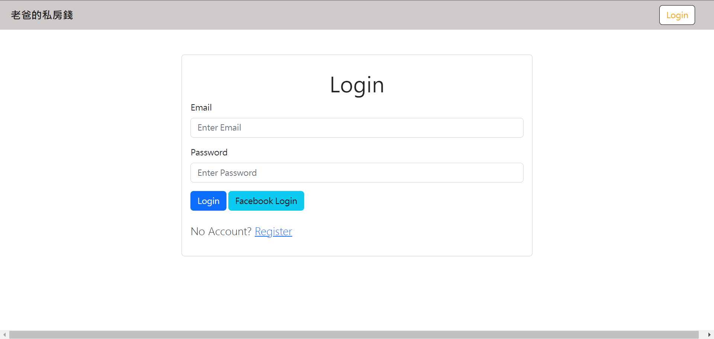
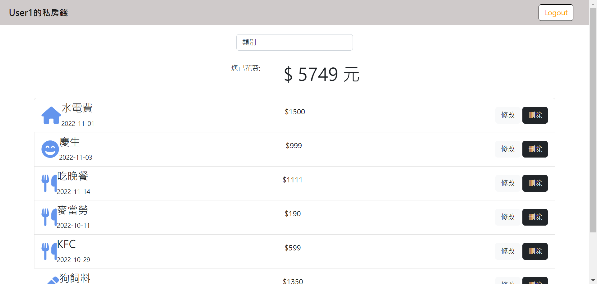

# Expense Tracker

讓使用者可以登入，並使用記帳功能。

## 功能介紹
* 創建使用者
* 使用者可使用第三方登入(FACEBOOK)
* 創建、修改、刪除記帳資料
* 可根據分類顯示
* 顯示分類總金額


## 首頁瀏覽



## 內容瀏覽



## 環境建置與需求 
* npm 
* node.js 

## 安裝
1. 將專案 clone 到本地
2. 透過終端機進入資料夾，輸入:
   ```
   npm install
   ```
3. 設定環境變數，請參考.env.example範例新增一個.env檔案

   ```
   FB_ID=SKIP
   FB_SECRET=SKIP
   FB_CALLBACK=http://localhost:3000/auth/facebook/callback
   SESSION_SECRET=USER_DEFINED
   MONGODB_URI=YOUR MONGODB_URI
   PORT=3000
   ```
4. 執行完畢之後輸入已下程式碼以執行種子資料。
   ```
   npm run seed
   ```
5. 看到以下訊息表示種子資料運行成功，並請ctrl+c跳出。
   ```
   Seeds done!
   ```
6. 執行程式
   ```
   npm run dev
   ```   
7. 看見此行訊息則代表順利運行
   ```
   we are now in 3000!
   ```
8. 請在瀏覽器輸入以下網址:
   http://localhost:3000
9. 有提供使用者可供測試:
   ```
   * User1
     email: user1@example.com
     password: 123
   ```
10. 結束使用請在終端機中輸入:
   ```
   ctrl + c
   ```
12. 再次開啟，從步驟6開始。

## 開發工具及套件

* Node.js 16.17.1
* Express 4.18.2
* Express-Handlebars 6.0.6
* Express-Session 1.17.3
* Mongoose 6.7.2
* Nodemon 2.0.20
* Method-Override 3.0.0
* Bcryptjs 2.4.3
* Connect-Flash 0.1.1
* Dotenv 16.0.3
* Passport 0.4.1
* Passport-Facebook 3.0.0
* Passport-Local 1.0.0


